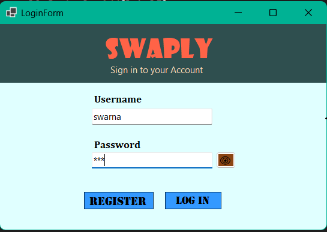
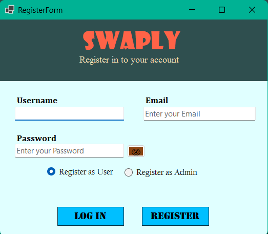
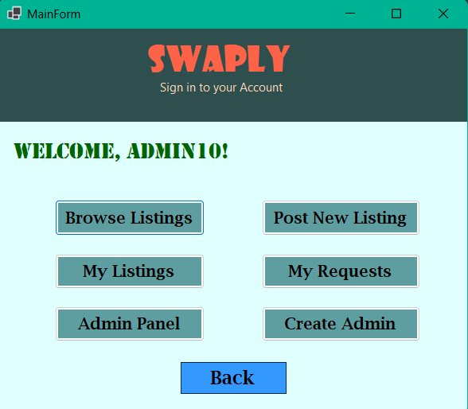
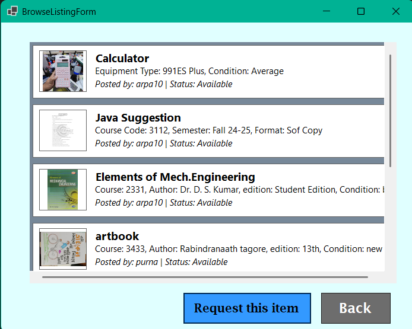
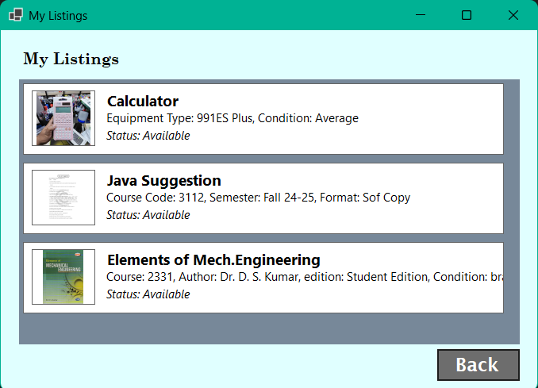
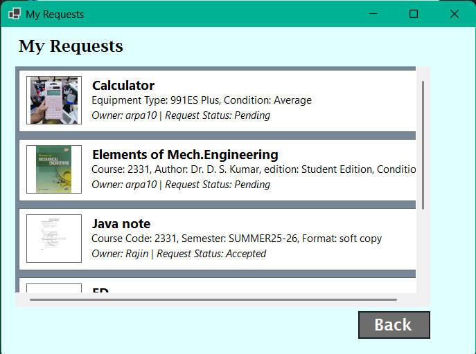
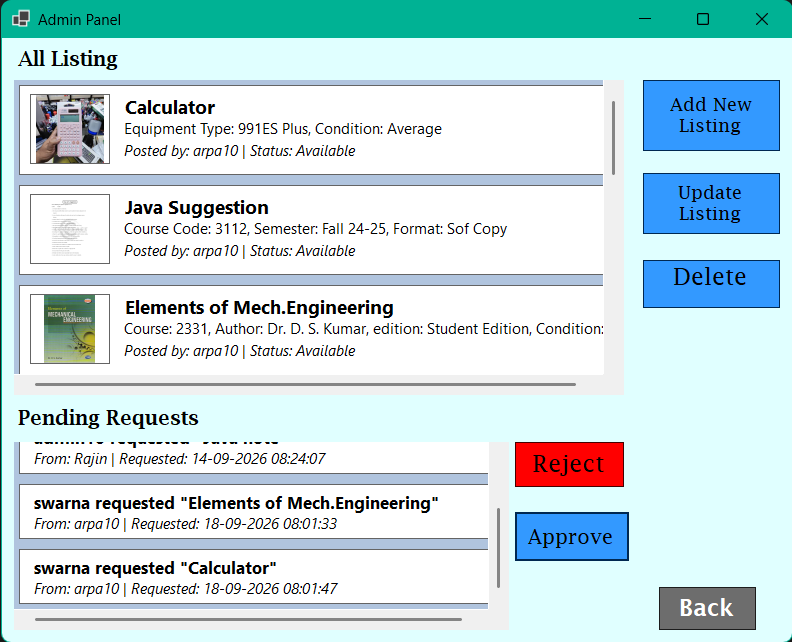
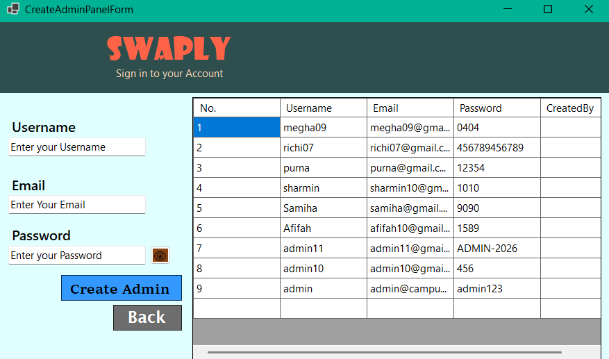

# Swaply

A campus marketplace desktop app where students can list, browse, and exchange second-hand books, notes, and equipment.

Built with C# and Windows Forms (.NET 10), backed by SQL Server.

## 📋 Project Overview

- Swaply is a desktop application that lets university students exchange second-hand items — books, equipment, notes, and more — within their own campus community
- Built with C# and Windows Forms, backed by a SQL database for storing users, listings, and transaction requests
- Supports two account types: **Student** and **Admin**, each with its own set of permissions
- Students can post items they want to sell/exchange, browse what others have posted, and send requests to claim an item
- Admins can view all listings platform-wide and approve or reject pending exchange requests between students
- Designed to replace the chaos of scattered Facebook groups and lost flyers with a single, organized, searchable marketplace built specifically for a university setting


---

## ✨ Features

- **Student & Admin accounts** — register, log in, and get routed to the right dashboard
- **Post listings** across three categories:
  - 📚 **Books** — course code, author, edition, condition
  - 📝 **Notes** — course code, semester, format
  - 🛠️ **Equipment** — type, condition
- **Browse & manage listings** — view all available items, edit or take down your own
- **Exchange requests** — request an item, track pending/accepted/rejected status
- **Admin panel** — approve or reject requests, delete listings, create new admin accounts
- **Image support** — attach a photo to each listing

---

## 🗂️ Project Structure

```
Swaply/
├── Program.cs                # App entry point
├── LoginForm.cs               # User login screen
├── RegisterForm.cs            # New user registration (Student/Admin)
├── MainForm.cs                # Main marketplace dashboard
├── BrowseListingForm.cs       # Browse all available listings
├── PostListingForm.cs         # Create a new listing
├── UpdateListingForm.cs       # Edit an existing listing
├── MyListingsForm.cs          # View your own posted listings
├── MyRequestsForm.cs          # View incoming/outgoing exchange requests
├── AdminPanelForm.cs          # Admin dashboard
├── CreateAdminPanelForm.cs    # Create a new admin account
│
├── User.cs                    # User model
├── Admin.cs                   # Admin model (extends User)
├── Listing.cs                 # Abstract base listing model
├── BookListing.cs             # Book listing (Listing subtype)
├── EquipmentListing.cs        # Equipment listing (Listing subtype)
├── NoteListing.cs             # Notes listing (Listing subtype)
├── TransactionRequest.cs      # Exchange request model
│
├── MarketPlace.cs             # Core business logic (users, listings, requests)
└── DatabaseHelper.cs          # Database connection & query execution
```

---

## 🧱 Tech Stack

| Layer | Technology |
|---|---|
| UI | C# / Windows Forms (.NET 10) |
| Database | Microsoft SQL Server |
| Data Access | Microsoft.Data.SqlClient |

---

## 🗄️ Database Schema

The app uses three main tables (see `SQLQuery2.sql`):

- **`Users`** — Id, Username, Email, Password, IsAdmin
- **`Listings`** — item details + category-specific fields (CourseCode, Author, Edition, EquipmentType, Semester, Format, Condition), Status, ImageData, OwnerId (FK → Users)
- **`TransactionRequests`** — RequesterId (FK → Users), ListingId (FK → Listings), Status, RequestDate

**Listing status:** `Available` → `Reserved` → `Sold`
**Request status:** `Pending` → `Accepted` / `Rejected`

---

## 🚀 Getting Started

1. **Set up the database**
   Run `SQLQuery2.sql` in SQL Server Management Studio to create `MyDB` and its tables.

2. **Configure the connection string**
   Update `App.config` with your SQL Server instance details.

3. **Restore & run**
   Open `Swaply.csproj` in Visual Studio and run the project (requires .NET 10 SDK + Windows Forms workload).

---

## 👤 User Roles

| Role        | Can do |
|---          |---|
| **Student** | Register/login, post & manage own listings, request items |
| **Admin**   | Everything a student can, plus approve/reject requests, delete any listing, create other admins |

## 🛠️ Tech Stack

- **Language:** C#
- **Framework:** .NET (Windows Forms)
- **Database:** SQL (via `DatabaseHelper`)
- **IDE:** Visual Studio

---

## 📸 Screenshots

### Login


### Register


### Main Dashboard


### Browse Listings


### My Listings


### My Requests


### Admin Panel


### Create Admin


---

## 🚀 Getting Started

### Prerequisites
- Visual Studio 2022 (or newer) with the **.NET Desktop Development** workload installed
- SQL Server / SQL Server Express (or update the connection string to match your setup)

### Installation

1. Clone the repository
   ```bash
   git clone https://github.com/swarnakarmakar10/SWAPLY
   ```
2. Open `Swaply.slnx` in Visual Studio
3. Update the database connection string in `DatabaseHelper.cs` to point to your local SQL instance
4. Run the SQL script (`SQLQuery2.sql`) to set up the required tables
5. Build and run the project (`F5`)

---

## 🔮 Future Improvements

- [ ] Add image upload support for listings
- [ ] In-app messaging between students
- [ ] Search and filter by category/price
- [ ] Email verification on registration
- [ ] Migrate to a cloud-hosted database for multi-device access

---

## 👤 Author

Built by [swarnakarmakar10]
GitHub [https://github.com/swarnakarmakar10] 
Linkedin [www.linkedin.com/in/swarna-karmakar1]